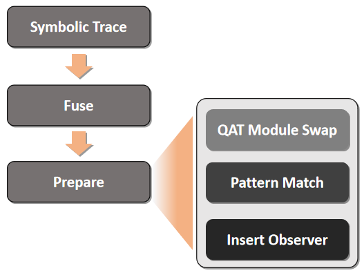

## Prepare流程


**本文基于Pytorch版本v1.8.0 (@37c1f4)。**

### 0. 概述

熟悉QAT流程的读者肯定知道，如果希望对一个模型进行QAT量化，一般需要对网络中的权重（weight）和激活值（activation）进行模拟量化，并在训练中借助模拟量化结点反向传播，对网络进行训练。


一个普通的nn.Module是如何转换得到插入模拟量化结点的模型的呢？在FX中，这个转换过程大体分为四个步骤：

（1）**符号跟踪（symbolic trace）**：通过对原网络的代码执行过程进行trace，建立原始nn.Module网络的图表示。

（2）**模块融合（fuse）**: 此步骤将满足模式的相邻模块融合成nn.Sequential。例如，将相邻的nn.Conv2d和nn.BatchNorm2d打包到一个nn.Sequential内，构成一个FusedModule，此后这个FusedModule将在prepare环节被替换成一个融合的模块。例如nn.Conv2d+nn.BatchNorm2d -> nn.intrinsic.qat.ConvBn2d。

（3）**模块交换（swap）**：此步骤是为了实现weight的模拟量化。由于nn.Conv2d中的weight是不带模拟量化（Fake Quantize）功能的，为了实现QAT中的模拟量化，需要把所有普通模块替换成可以进行模拟量化的QAT module，而这些module一般都定义在torch.nn.qat当中。torch官方已经对这些模拟量化module的forward和backward进行了实现，可以在训练过程中实现反向传播。例如nn.Conv2d -> nn.qat.intrinsic.Conv2d。

（4）**activation量化结点插入（insert observer）**：此步骤是为了实现对activation的模拟量化（或者在PTQ中插入观察结点，实现对激活值数据分布的观察）。



以上即为一个普通的nn.Module转换为一个可进行QAT的graph module的大致流程。本文后续内容将深入每个环节对其中包含的诸多操作进行拆解，条分缕析。

***


### 1. **符号跟踪（Symbolic Trace）**

符号跟踪在前一节我们已经做了详细地介绍，此处不再重复叙述。

### 2. **模块融合（fuse）**


### 3. **模块交换（swap）**

从模块交换开始，以下内容涉及的代码部分绝大部分在torch/quantization/fx/quantize.py中Quantizer类的_prepare方法中。

#### **3.1 准备工作 —— 传播量化配置（propagate）** *L#423*
    
传播量化配置的propagate_qconfig_函数接受两个参数作为输入，其一为待量化的graph module，其二为指定module量化方式的flattened_qconfig_dict。

```python
propagate_qconfig_(model, flattened_qconfig_dict)
```

propagate_qconfig_实际调用的是_propagate_qconfig_helper函数。这是一个递归实现的函数，当module存在named_children时，该函数会递归地为途经到的每个module使用setattr方法增加一个qconfig属性，而这个qconfig属性即来自于我们传入的flattened_qconfig_dict。

同时，在实际量化中，网络中各个层的量化配置（权重位宽、激活值位宽等）未必完全相同。为此FX允许用户通过module的名字指定其qconfig。

```python
def _propagate_qconfig_helper(module, qconfig_dict, allow_list=None,
                              qconfig_parent=None, prefix=''):
    if allow_list is None:
        allow_list = get_default_qconfig_propagation_list()

    module_qconfig = qconfig_dict.get(type(module), qconfig_parent)
    module_qconfig = qconfig_dict.get(prefix, module_qconfig)
    module_qconfig = getattr(module, 'qconfig', module_qconfig)

    torch.quantization.qconfig.assert_valid_qconfig(module_qconfig, module)

    module.qconfig = module_qconfig
    for name, child in module.named_children():
        module_prefix = prefix + '.' + name if prefix else name
        _propagate_qconfig_helper(child, qconfig_dict, allow_list,
                                  module_qconfig, module_prefix)
```

#### **3.2 模块替换** *L#427*

在传播完成量化配置后，即可将每个nn.Module转换为QAT module，这时候就用到了_qat_swap_module方法。

```python
if model.training:
   additional_qat_module_mapping = prepare_custom_config_dict.get(
                "additional_qat_module_mapping", {})
   self._qat_swap_modules(model, additional_qat_module_mapping)
```

我们来看一下_qat_swap_modules方法的内容:
```python
def _qat_swap_modules(
        self, root: torch.nn.Module,
        additional_qat_module_mapping: Dict[Callable, Callable]) -> None:
        all_mappings = get_combined_dict(
            get_default_qat_module_mappings(), additional_qat_module_mapping)
    convert(root, mapping=all_mappings, inplace=True, remove_qconfig=False)
```

_qat_swap_module方法先对默认的qat_module_mapping和用户提供的addtional_qat_mapping方式进行合并，得到网络整体的QAT module的映射方式，之后调用convert函数，将graph module和mapping方式一并作为参数传入，开始进行替换。

随着调用栈的深入，我们可以发现convert最终调用了torch/quantization/quantize.py中的_convert函数。

为简便起见，我们跳过_convert函数中参数准备的部分，直入正题，看看它是如何实现module到QAT module替换的。

```python
for name, mod in module.named_children():
    # both fused modules and observed custom modules are
    # swapped as one unit
    if not isinstance(mod, _FusedModule) and \
       type(mod) not in custom_module_class_mapping:
        _convert(mod, mapping, True,  # inplace
                 custom_module_class_mapping)
    reassign[name] = swap_module(mod, mapping,custom_module_class_mapping)
for key, value in reassign.items():
    module._modules[key] = value
return module
```

以上就是其中替换部分的代码片段，可以看出，此处使用了一个递归实现，当传入该函数的mod不是一个FusedModule，且这个mod没有相应的用户自定义mapping时，就递归执行。当mod满足其中任意一个条件时，则执行swap_module。而swap_module所做的正是把传入的mod根据mapping包含的映射关系，获得其对应的QAT module。

当然这一步并不会发生真正意义上的替换，仅仅是把各个mod对应的QAT module根据mod的名字放到一个字典（dict）当中。当网络的所有mod都被递归地映射完成，得到所有的[mod name, QAT module]的关系后，再统一进行更新。这里就用到了Pytorch nn.Module的保存模块的一个特性，也即nn.Module所包含的module实际都存储在_modules这个字典当中，通过对这个字典的键值对进行更新就实现了对nn.Module的更新。

以上即是QAT module的自动替换的过程。

对普通nn.Module与QAT module在Pytorch中区别感兴趣的读者，我们在下面一小节中单独进行了一些介绍，而对于主要想了解FX工作原理的读者，下面一小节可以跳过，完全不影响后续的阅读。

#### **3.3 nn.Module，QAT module，quantized module的区别**

**3.3.1 nn.Module**

普通的nn.Module实现在torch/nn/modules下，其中都是我们耳熟能详的一些网络操作，例如Conv1d/2d/3d，Linear，BatchNorm1d/2d/3d，ReLU/Sigmoid/Swish等等。这些模块的forward实际调用了torch.nn.functional中对应的可微分函数，因此通过反向传播被优化。

**3.3.2 QAT module**

QAT module实现在torch/nn/qat/modules和torch/nn/intrinsic/qat/modules中。

其中intrinsic下的模块均为fused后的操作，目前包含了：
- **ConvBN（1d/2d/3d）**
- **ConvBNReLu（1d/2d/3d）**
- **LinearReLU**

而torch/nn/qat/modules下的模块与普通nn.Module对应，均为独立的操作。但由于并非所有的nn.Module都存在可量化的实现方式，所以qat/modules下的模块是nn.Module包含操作的一个子集。以QAT Conv2d为例，我们可以看看它们有何异同：

**3.3.3 quantized module**

quantized module实现在torch/nn/quantized/modules和torch/nn/intrinsic/quantized/modules中。

我们以quantized Conv2d为例看一下它和nn.Module和QAT module的异同。以下为quantized Conv2d的forward代码片段：

```python
def forward(self, input):
     # Temporarily using len(shape) instead of ndim due to JIT issue
     # https://github.com/pytorch/pytorch/issues/23890
     if len(input.shape) != 4:
         raise ValueError("Input shape must be `(N, C, H, W)`!")
     if self.padding_mode != 'zeros':
         _reversed_padding_repeated_twice = _reverse_repeat_padding(self.padding)
         input = F.pad(input, _reversed_padding_repeated_twice,
                       mode=self.padding_mode)
     return ops.quantized.conv2d(
         input, self._packed_params, self.scale, self.zero_point)
```

尽管quantized module也继承自nn.Module，它的forward函数中调用的却并非functional中的可微分操作，而是torch的原生op。而quantized Conv2d原生op（ops.quantized.conv2d）的实现在aten/src/ATen/native/quantized/cpu/qconv_prepack.cpp中。从目录名也可推知其义，这是一个真正的量化推理操作，只能运行在cpu上。没错，它是对量化后的网络进行量化推理的模块，因而没有反向传播（backward）方法和绑定关系。

### 4. **activation量化结点插入**

以上我们看到了FX是如何实现对weight量化结点的引入的，接下来我们可以看一下FX是如何实现对activation结点的插入。尽管FX的图表示支持在一张已创建好的图的任意结点前后进行插入和删除操作，目前FX却没有采用这种方式来进行activation量化结点的插入。相反地，FX采取的策略是：直接创建一张空图，然后按照原网络对应图表示的结点的拓扑顺序，依次向空图中拷贝原图中的结点，并根据该结点匹配到的**量化模式**和**qconfig是否包含了activation量化配置**来决定是否在拷贝结点后插入相应的量化结点。

了解了FX插入activation量化结点的方式后，我们来具体看一下它的代码实现。

#### **4.1 量化模式匹配（pattern match）**

这是FX量化结点插入中很有特色的一个部分。在进行量化结点插入的过程中，有时候我们会希望根据特定结点之间的连接模式来决定如何插入activation量化。为此，FX中引入了模式匹配机制。这些模式匹配不仅在量化中，在fuse中也被使用，此处我们只介绍量化中的使用。

**4.1.1 量化模式**

一个典型的activation量化插入和结点连接模式有关的例子是elementwise add。下图中展示了一个residual block，其中x和F(x)通过一个elementwise add操作进行了相加并通过一个relu激活函数得到了这个block的输出。这种连接方式也自然而然引出一个问题，实际量化过程中，如果我们只判断relu激活函数，并在之后插入一个activation量化，这似乎没有什么问题，因为add操作紧邻的relu会被量化。但如果add后面没有relu，那我们就会少插入了一个结点。反之，如果我们寻找所有的add操作，并在每个add后插入一个activation量化，就会存在add -> relu这样的连接被重复插入量化结点的问题。因此，以上现象提示，如果能通过判断结点连接模式的方式来决定是否插入activation量化，就有可能解决此类问题。


**4.1.2 定义量化模式**

那么FX中的量化模式该如何定义？如何在量化过程中发挥作用呢？

关于量化模式的定义都位于torch/quantization/fx/quantization_pattern.py中。以下代码段展示了定义并添加一个简单（单个结点即构成一个模式）的量化模式的方法。对于一个全新的量化模式，我们需要准备两样东西，一个是该模式对应的module表示，也即@register_quant_pattern装饰器传入的参数；另一个是我们需要为这个模式定义相应的QuantizeHandler，以便FX能在convert阶段找到这个模式所对应的转换方法。这里的convert，是指FX在对模型量化完毕之后，转换到相应的量化推理模块（quantized module）的过程，由于我们后面会有专门的篇幅对此进行介绍，在这里便不再展开叙述。不过如果我们只关心量化过程，而不需要或者暂时没有对应的量化推理kernel，QuantizeHandler类的convert部分也可以跳过。

```python
@register_quant_pattern(torch.cat)
class Cat(QuantizeHandler):
    def convert(self, quantizer: QuantizerCls, node: Node, load_arg: Callable,
                debug: bool = False,
                convert_custom_config_dict: Dict[str, Any] = None) -> Node:
        if not self.all_node_args:
            return NotImplemented
        activation_post_process = quantizer.activation_post_process_map[node.name]
        scale, zero_point = activation_post_process.calculate_qparams()
        scale = float(scale)
        zero_point = int(zero_point)

        scale_arg, zero_point_arg = create_qparam_nodes(quantizer, node.name, scale, zero_point)

        kwargs = {**load_arg(quantized=False)(node.kwargs), 'scale': scale_arg, 'zero_point': zero_point_arg}
        return quantizer.quantized_graph.create_node(
            'call_function', torch.ops.quantized.cat, load_arg(quantized=[0])(node.args), kwargs)
```

当然，有时候很多结点可以复用一个QuantizeHandler，也即它们的convert操作是类似的，这时我们就可以在定义QuantizeHandler的上方对这些模式一起进行注册。不过需要注意的是，由于装饰器的作用顺序问题，会导致处在下方的模式会优先被匹配。


```python
@register_quant_pattern(torch.nn.intrinsic.qat.ConvBn1d)
@register_quant_pattern(torch.nn.intrinsic.qat.ConvBn2d)
@register_quant_pattern(torch.nn.intrinsic.qat.ConvBn3d)
```

两个结点的匹配，以(torch.nn.ReLU, operator.add)为例，该模式匹配：

```python
@register_quant_pattern((torch.nn.ReLU, operator.add))
```

**4.1.3 量化模式的匹配** *L#436 - L#448*

量化模式的匹配过程，我们可以通过find_matches函数来一窥究竟。

find_matches的最关键的部分是is_match函数，我们来具体分析一下is_match函数：

```python
def is_match(modules, node, pattern, max_uses=sys.maxsize):
    """ Matches a node in fx against a pattern
    """
    if isinstance(pattern, tuple):
        self_match, *arg_matches = pattern
        if self_match is getattr:
            assert len(pattern) == 2, 'Expecting getattr pattern to have two elements'
            arg_matches = []
    else:
        self_match = pattern
        arg_matches = []

    if isinstance(self_match, type) and issubclass(self_match, MatchAllNode):
        return True

    if len(node.users) > max_uses:
        return False

    if isinstance(self_match, type) and issubclass(self_match, torch.nn.Module):
        if node.op != 'call_module':
            return False
        if not type(modules[node.target]) == self_match:
            return False
    elif callable(self_match):
        if node.op != 'call_function' or node.target is not self_match:
            return False
        elif node.target is getattr:
            if node.args[1] != pattern[1]:
                return False
    elif isinstance(self_match, str):
        if node.op != 'call_method' or node.target != self_match:
            return False
    elif node.target != self_match:
        return False

    if not arg_matches:
        return True

    if len(arg_matches) != len(node.args):
        return False

    return all(is_match(modules, node, arg_match, max_uses=1) for node, arg_match in zip(node.args, arg_matches))
```
is_match函数使用一个递归实现，通过对一个pattern包含的各个结点进行分解，并对分解得到的每个module（functional）进行比对，判断当前的node是否满足pattern中的module（functional），并依次递归。当输入的node不断递归其输入参数，并且在其递归过程中每个结点都能和pattern中的类型相匹配时，说明输入结点是该pattern的根结点，因此返回True。

举例，网络拓扑如下所示，pattern定义为(nn.ReLU, nn.Conv2d)。
x -> conv1 -> bn1 -> relu1 -> conv2 -> relu2 -> out

当输入结点relu1和pattern时，is_match返回False；当输入结点relu2和pattern时，is_match返回True。

此外，torch/quantization/fx/pattern_utils.py当中还定义了一个特殊模块MatchAllNode。当以MatchAllNode作为pattern中的一项时，该位置可以匹配任何类型的结点而不关心其实际的类型，进而可以实现模糊模式匹配。

#### **4.2 创建空图** *L#456 - L#459*

以下为FX中创建空图的代码片段，可以看到，在创建空图的同时，还有其他一些变量也随之创建。

```python
self.activation_post_process_map = dict()
env: Dict[Any, Any] = {}
observed_graph = Graph()
observed_node_names_set: Set[str] = set()
```
- self.activation_post_process_map：记录"结点名 - activation量化"之间的关系
- env: 一个字典，用于记录"结点名 - 输出结点"的关系
- observed_graph: Graph module，空图，等待向其中添加结点
- observed_node_names_set：一个集合，用于记录已经被处理过的结点，防止结点被重复处理

#### **4.3 根据结点类型和QConfig插入量化结点**

这是activation量化结点插入环节中最关键也最繁琐的一步，实际上在最新的Pytorch实现中，FX开发者已经对这里的逻辑进行了重构，代码更加简洁清晰。不过此处我们仍然按照v1.8.0版本的代码为准，进行解读。


**4.3.1 准备工作** *L#461 - L#479*

这里首先定义了一个load_arg函数，实际上这个load_arg函数就是在env中取出对应结点的输出结点。

```python
def load_arg(a):
    return map_arg(a, lambda node: env[node.name])

graph_inputs = []
for node in model.graph.nodes:
    if node.op == 'placeholder':
        graph_inputs.append(node.name)

get_new_observer_name = get_new_attr_name_with_prefix(
    'activation_post_process_')

placeholder_node_seen_cnt = 0
output_node_seen_cnt = 0
input_quantized_idxs: List[int] = self.prepare_custom_config_dict.get(
    "input_quantized_idxs", [])
output_quantized_idxs: List[int] = self.prepare_custom_config_dict.get(
    "output_quantized_idxs", [])

result_node : Optional[Node] = None
```


**4.3.2 处理输出结点** *L#480 - L#504*

以下是FX对输出结点的处理逻辑。当FX遇到结点对应的op为输出时，FX会寻找该结点的输入结点，并尝试在这个输入结点的输出上插入一个observer（Fake Quantize）结点。

```python
for node in model.graph.nodes:
    if node.op == 'output':
        # If this output is hardcoded to be quantized, insert an
        # observer on the previous node if it does not already
        # exist.
        cur_output_node_idx = output_node_seen_cnt
        output_node_seen_cnt += 1
        if cur_output_node_idx in output_quantized_idxs:
            prev_node = node.args[0]
            assert isinstance(prev_node, Node), \
                ('hardcoding list/dict outputs to be quantized is ' +
                 'not supported')
            if prev_node.name not in observed_node_names_set:
                assert self.qconfig_map is not None
                local_qconfig = self.qconfig_map[prev_node.name]
                assert local_qconfig is not None, \
                    'qconfig of a node before a quantized output must exist'
                insert_observer(
                    prev_node, local_qconfig.activation(),
                    model, self.activation_post_process_map,
                    env, observed_graph, load_arg, observed_node_names_set)

        observed_graph.output(load_arg(node.args[0]))
        result_node = node
        continue
```

**深入insert_observer函数**

```python
def insert_observer(
        node: Node, observer: torch.quantization.ObserverBase,
        model: torch.nn.Module,
        activation_post_process_map: Dict[str, torch.quantization.ObserverBase],
        env: Dict[Any, Any], observed_graph: Graph, load_arg: Callable,
        observed_node_names_set: Set[str]):
    """Insert observer for node by modifying the observed_graph and
       attach observer module to the model
       Args:
         node: Node
         observer: observer/fake_quantize module instance
    """
    # respect device affinity when adding observers
    model_device = assert_and_get_unique_device(model)
    if model_device:
        observer.to(model_device)
    # add observer module as attribute
    prefix = node.name + '_activation_post_process_'
    get_new_observer_name = get_new_attr_name_with_prefix(prefix)
    observer_name = get_new_observer_name(model)
    setattr(model, observer_name, observer)
    # put observer instance activation_post_process map
    assert activation_post_process_map is not None
    activation_post_process_map[node.name] = observer
    # insert observer call
    env[node.name] = observed_graph.create_node(
        'call_module', observer_name, (load_arg(node),), {})
    observed_node_names_set.add(node.name)
```

在处理输出结点的代码中，我们第一次遇到了insert_observer这个函数。实际上，后续有关中间结点的处理中，也会用到这个函数，为此，我们深入insert_observer函数内部，看一下它到底做了些什么。

从注释部分不难看出，insert_observer函数先是尝试获取model所在的device，之后便将observer也发送到该device上（保持device一致，便于后续训练）。随后，根据结点的名字，为需要插入的observer命名，并使用setattr将例化好的observer添加为model的属性，以便后续调用。observer和结点名称的对应关系被记录在activation_post_process_map当中。最后在正被建立的图上创建相应的结点，这样可以在后续生成代码，这些observer也可以在新代码中被调用。

同时，env中记录的"结点名-输出"的对应关系也从"结点名-当前结点"变成了"结点名-当前结点的observer"。这样后续再次调用load_arg函数查询后继结点的输入参数时，其输入结点便更新成了对应的observer。

**4.3.2 处理网络中间层结点** *L#509 - L#529*

```python
if node.name in observed_node_names_set:
    continue

root_node, matched_nodes, pattern, obj, qconfig = matches.get(
    node.name, (None, None, None, None, None))
if root_node is None:
    env[node.name] = observed_graph.node_copy(node, load_arg)
elif root_node is node:
    env[node.name] = observed_graph.node_copy(node, load_arg)
    # index for input of custom module that needs to be observed in
    # parent
    if qconfig is not None:
        assert obj is not None
        standalone_module_input_idxs = \
            maybe_insert_observer_for_special_module(
                obj, self.modules, prepare_custom_config_dict, qconfig,
                node)
        insert_observer_for_output_of_the_node(
            node, obj, qconfig, self.modules, model, pattern,
            self.activation_post_process_map, env,
            observed_graph, load_arg, observed_node_names_set,
            matched_nodes, standalone_module_input_idxs)
else:
    env[node.name] = observed_graph.node_copy(node, load_arg)
```

**4.3.3 处理输入结点** *L#531 - L#538*

输入结点其实并没有做处理。

```python
if node.op == 'placeholder':
    # skip adding observers at the graph input if the input is
    # overriden to be quantized
    cur_placeholder_node_idx = placeholder_node_seen_cnt
    placeholder_node_seen_cnt += 1
    if cur_placeholder_node_idx in input_quantized_idxs:
        observed_node_names_set.add(node.name)
        continue
```


### **FAQ汇总**：

#### 1. 在FX中有哪些重要的自定义配置？
   
问题的答案就在prepare函数的注释当中，prepare实际上支持了比较丰富的自定义配置。
- 自定义模块融合方法：
  - 字段："additional_fuser_method_mapping"，值为用户自定义的融合方法。例子，当我们有自己的Conv2d和BN的融合方式，希望替代FX官方默认的融合方式时，即可使用这个选项，通过定义"模式 - 融合方法"这样的字典项来实现对默认融合方式的替换。
  
- 自定义nn.Module和QAT module的映射方式：如果我们自行实现了某个nn.Module的QAT module并希望在QAT训练中使用时，即可按照以上自定义融合方法类似的方式，通过传入这个额外配置来实现对默认QAT module映射的替换。
  
- 自定义融合模式：
  
- 自定义量化模式：如果我们希望定义一个新的量化模式，那么通过自定义这个模式对应的QuantizeHandler，之后传入包含"模式-QuantizeHandler"的字典项即可。

```python
# Additional fuser_method mapping
"additional_fuser_method_mapping": {
   (torch.nn.Conv2d, torch.nn.BatchNorm2d): fuse_conv_bn
},
# Additioanl module mapping for qat
"additional_qat_module_mapping": {
   torch.nn.intrinsic.ConvBn2d: torch.nn.qat.ConvBn2d
},
# Additional fusion patterns
"additional_fusion_pattern": {
   (torch.nn.BatchNorm2d, torch.nn.Conv2d): ConvReluFusionhandler
},
# Additional quantization patterns
"additional_quant_pattern": {
   torch.nn.Conv2d: ConvReluQuantizeHandler,
   (torch.nn.ReLU, torch.nn.Conv2d): ConvReluQuantizeHandler,
}
```

- 此外，还可以指定网络中特定module的qconfig。

#### 2. FX中目前已知的一些缺陷和问题？
   
   1.1 Bias Correction （BC）的实现方式：目前的BC是一个未被公开的API，但用户仍然可以通过调用torch/quantization/_correct_bias.py中的bias_correction函数使用BC功能。但需要注意的是，bias_correction只接受经过convert的graph module。而Pytorch支持的quantized module只有CPU上的kernel实现，这就导致了在大数据集/大网络上进行BC的时候计算效率较低，无法使用GPU加速。

   1.2 Weight Equalization：不支持组卷积。

   1.3 ONNX导出：因为量化模块的pre_packed params的问题，目前QAT模型无法直接导出到ONNX。

   1.4 自定义融合模式的Bug：

#### 3. 如果希望为FX添加自定义功能，有什么好的方式？ 
